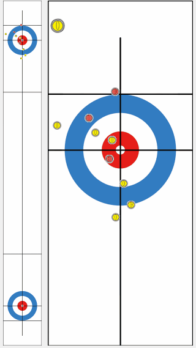
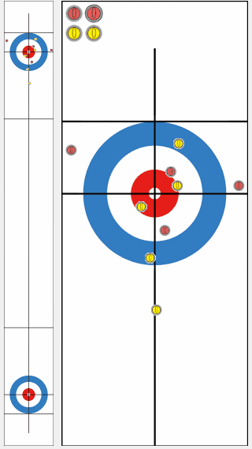

# KR-DL-UCT

This repository provides the source codes for KR-DL-UCT algorithm in the paper.

[Deep Reinforcement Learning in Continuous Action Spaces: a Case Study in the Game of Simulated Curling](http://proceedings.mlr.press/v80/lee18b/lee18b.pdf) by Kyowoon Lee, Sol-A Kim, Jaesik Choi and Seong-Whan Lee in [ICML-2018](https://icml.cc/Conferences/2018)

## Abstract
Many real-world applications of reinforcement learning require an agent to select optimal actions from continuous action spaces. Recently, deep neural networks have successfully been applied to games with discrete actions spaces. However, deep neural networks for discrete actions are not suitable for devising strategies for games in which a very small change in an action can dramatically affect the outcome. In this paper, we present a new framework which incorporates a deep neural network that can be used to learn game strategies based on a kernel-based Monte Carlo tree search that finds actions within a continuous space. To avoid hand-crafted features, we train our network using supervised learning followed by reinforcement learning with a high-fidelity simulator for the Olympic sport of curling. The program trained under our framework outperforms existing programs equipped with several hand-crafted features and won an international digital curling competition.

<!-- This version of software is developed by Kyowoon Lee, Sol-a Kim and Jaesik Choi, members of [Statistical Artificial Intelligence Laboratory (SAIL)](http://sail.unist.ac.kr) at Ulsan National Institute of Science and Technology (UNIST), Korea. This is joint work with Prof. Seong-Whan Lee at Korea University. -->

## Prerequisites
- Python 2.7 or Python 3.3+
- [Tensorflow](https://www.tensorflow.org/?hl=en)
- [cython](https://cython.readthedocs.io/en/latest/)

## Install

To get our code:

```bash
git clone --recursive https://github.com/leekwoon/KR-DL-UCT.git
```

To install:

```bash
python setup.py install build_ext --inplace
```

## Running examples

In this code, you can run the game by using our algorithm. The game log will be located in `./data`

```
python -m src.tests.game_test
```

You can download the [latest simulator](http://minerva.cs.uec.ac.jp/curling/wiki.cgi?page=%A5%C0%A5%A6%A5%F3%A5%ED%A1%BC%A5%C9) and watch the game from the log file.




Description of simulator are available from
http://minerva.cs.uec.ac.jp/curling_en/wiki.cgi?page=Description+of+each+part

## Authors

[Kyowoon Lee](http://sail.unist.ac.kr/members/)\*<sup>1</sup>(leekwoon@unist.ac.kr), [Sol-A Kim](http://sail.unist.ac.kr/members/)\*<sup>1</sup>(sol-a@unist.ac.kr), [Jaesik Choi](http://sail.unist.ac.kr/members/jaesik/)<sup>1</sup>(jaesik@unist.ac.kr), [Seong-Whan Lee](http://ibi.korea.ac.kr/sub2_1.php?code=LSW)<sup>2</sup>(sw.lee@korea.ac.kr)

<sup>1</sup>[UNIST](http://www.unist.ac.kr/) @ Department of Computer Engineering, UNIST, Ulsan, Republic of Korea

<sup>2</sup>[Korea University](http://www.korea.ac.kr/mbshome/mbs/en/index.do) @ Department of Brain and Cognitive Engineering, Korea University, Seoul, Republic of Korea
